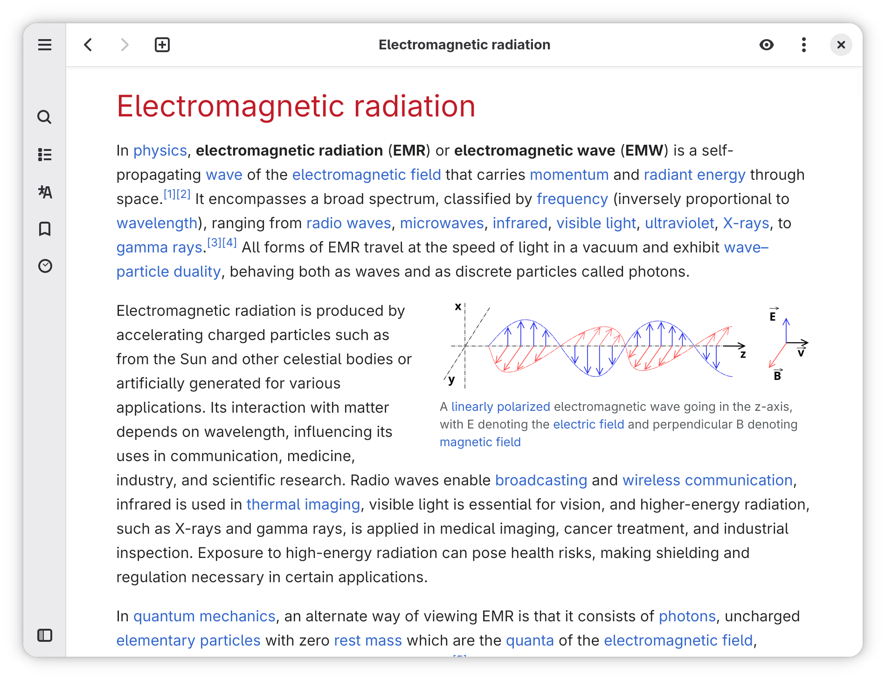

# Wike

Search and read Wikipedia articles

## Description

*Wike* is a Wikipedia reader for the GNOME Desktop.
Provides access to all the content of this online encyclopedia in a native application, with a simpler and distraction-free view of articles.

### Features

- Open multiple articles in tabs
- More than 300 languages
- Search suggestions
- Bookmarks management
- History of recent articles
- Table of contents
- Text search in articles
- Print articles
- Light, dark and sepia themes
- Desktop and mobile layouts
- GNOME Shell search integration

## Install

### Flatpak

This is the official package. You can install it from Flathub.

### Snap

Get it from the Snap Store.

### Other installation methods

|Distro|Package Name/Link|Maintainer|
|:----:|:----:|:----:|
| Arch Linux (AUR) | [`wike`](https://aur.archlinux.org/packages/wike/) | [Mark Wagie](https://github.com/yochananmarqos) |
| Ubuntu (official package) | [`wike`](https://launchpad.net/ubuntu/+source/wike) | [Matthias Geiger](https://github.com/werdahias) |
| Ubuntu (PPA) | [`wike`](https://code.launchpad.net/~apandada1/+archive/ubuntu/wike) | [Archisman Panigrahi](https://github.com/archisman-panigrahi) |
| Debian Linux (bookworm and later) | [`wike`](https://tracker.debian.org/pkg/wike) | [Matthias Geiger](https://github.com/werdahias) |
| Fedora Linux | [`wike`](https://src.fedoraproject.org/rpms/wike) | [Gustavo Costa](https://github.com/xfgusta) |

## Build

*Wike* can be built and run with [GNOME Builder](https://wiki.gnome.org/Apps/Builder).

1. Open GNOME Builder
2. Click the **Clone Repository** button
3. Enter `https://github.com/hugolabe/wike.git` in the field **Repository URL**
4. Click the **Clone Project** button
5. Click the **Run** button to start building application

## Translations

You can help translate *Wike* on the [POEditor](https://poeditor.com/join/project?hash=kNgJu4MAum) platform.

## License

*Wike* is released under the terms of the [GNU General Public License V3](https://www.gnu.org/licenses/gpl-3.0.html).

All content provided by the app comes from [Wikipedia.org](https://www.wikipedia.org/) and is available under [Creative Commons Attribution-ShareAlike License 4.0](https://creativecommons.org/licenses/by-sa/4.0/) unless otherwise noted.
*Wike* is an independent development not endorsed by or affiliated with the [Wikimedia Foundation](https://wikimediafoundation.org/).

*Wike* uses a subset of [circle-flags](https://github.com/HatScripts/circle-flags) icons, copyright by [HatScripts](https://github.com/HatScripts), and released under the [MIT license](https://opensource.org/license/mit/).
