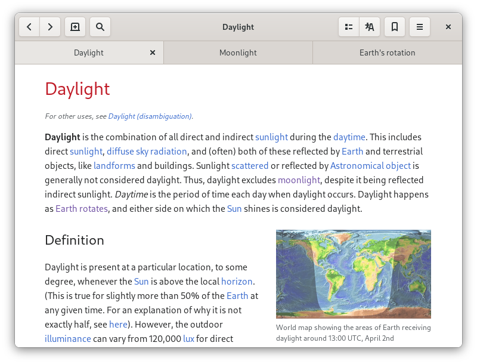

  
  <h1 align="center">Wike</h1>
  
Provides access to all the content of this online encyclopedia in a native application, with a simpler and distraction-free view of articles

  
  
 
 

 

## Features

- Open multiple articles in tabs
- Multiple languages
- Search suggestions
- List of recent articles
- Simple bookmarks management
- Text search in articles
- Article table of contents
- View article in other languages
- GNOME Shell search integration
- Light, dark and sepia themes

## GNOME Circle

Wike is part of GNOME Circle.

## Install

You can install **Wike** from Flathub.org

### Other installation methods

|Distro|Package Name/Link|Maintainer|
|:----:|:----:|:----:|
| Arch Linux (AUR) | [`wike`](https://aur.archlinux.org/packages/wike/) | [Mark Wagie](https://github.com/yochananmarqos) |
| Ubuntu (kinectic and later) | [`wike`](https://launchpad.net/ubuntu/+source/wike) | [Matthias Geiger](https://github.com/werdahias) |
| Debian Linux (bookworm and later) | [`wike`](https://tracker.debian.org/pkg/wike) | [Matthias Geiger](https://github.com/werdahias) |
| Fedora Linux | [`wike`](https://src.fedoraproject.org/rpms/wike) | [Gustavo Costa](https://github.com/xfgusta) |

## Build

*Wike* can be built and run with [GNOME Builder](https://wiki.gnome.org/Apps/Builder).

1. Open GNOME Builder
2. Click the **Clone Repository** button
3. Enter `https://github.com/hugolabe/wike.git` in the field **Repository URL**
4. Click the **Clone Project** button
5. Click the **Run** button to start building application

## Translations

You can help translate *Wike* on the [POEditor](https://poeditor.com/join/project?hash=kNgJu4MAum) platform.

<b>Wike</b> is released under the terms of the <a href="https://www.gnu.org/licenses/gpl-3.0.html">GNU General Public License V3</a>.

