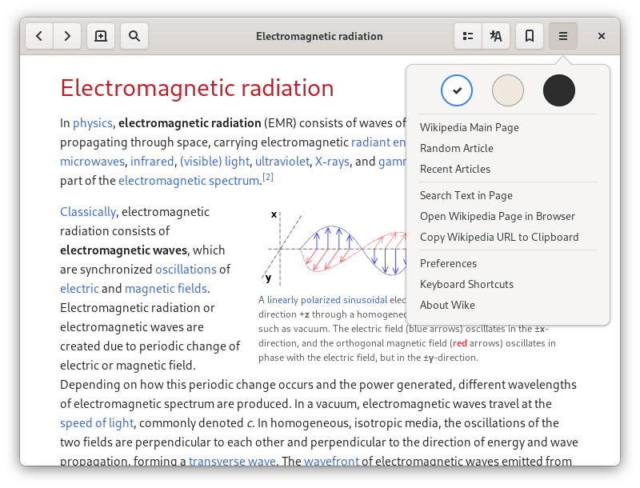

# Wike

*Wike* is a Wikipedia reader for the GNOME Desktop.
Provides access to all the content of this online encyclopedia in a native application, with a simpler and distraction-free view of articles.

## Features

- Multiple languages
- Search suggestions
- List of recent articles
- Simple bookmarks management
- Text search in articles
- Article table of contents
- View article in other languages

## Install

You can install *Wike* from Flathub.org

### Other installation methods

|Distro|Package Name/Link|Maintainer|
|:----:|:----:|:----:|
| Arch Linux (AUR) | [`wike`](https://aur.archlinux.org/packages/wike/) | [Mark Wagie](https://github.com/yochananmarqos) |
| Ubuntu (PPA) | [`wike`](https://launchpad.net/~apandada1/+archive/ubuntu/wike) | [Archisman Panigrahi](https://github.com/apandada1) |

## Build

*Wike* can be built and run with [GNOME Builder](https://wiki.gnome.org/Apps/Builder).

1. Open GNOME Builder
2. Click the **Clone Repository** button
3. Enter `https://github.com/hugolabe/wike.git` in the field **Repository URL**
4. Click the **Clone Project** button
5. Click the **Run** button to start building application

## Translations

You can help translate *Wike* on the [POEditor](https://poeditor.com/join/project?hash=kNgJu4MAum) platform.

## License

*Wike* is released under the terms of the [GNU General Public License V3](https://www.gnu.org/licenses/gpl-3.0.html).

